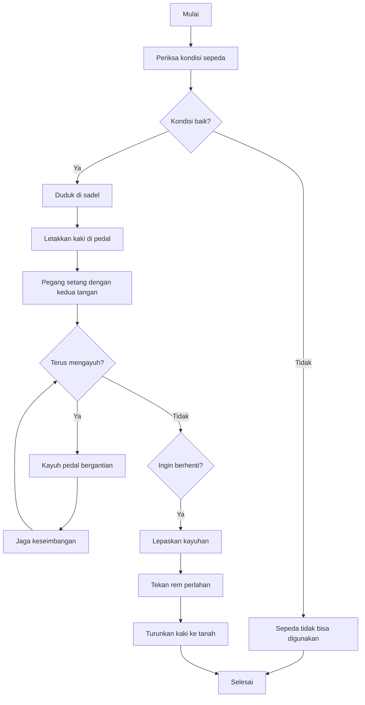

# Cara Mengoperasikan Sepeda Ontel (Kayuh)

## 1. Pseudocode

```
BEGIN
    INPUT kondisi_sepeda
    IF kondisi_sepeda = "baik" THEN
        DUDUK di sadel
        LETAKKAN kaki pada pedal
        PEGANG tangan pada setang
        WHILE terus_mengayuh DO
            KAYUH pedal bergantian kanan–kiri
            JAGA keseimbangan
            IF ingin_berhenti = TRUE THEN
                LEPASKAN kayuhan
                TEKAN rem perlahan
                TURUNKAN kaki ke tanah
                EXIT LOOP
            ENDIF
        ENDWHILE
    ELSE
        OUTPUT "Sepeda tidak bisa digunakan"
    ENDIF
END
```

## 2. Diagram Alur (Flowchart)



created by: Priti Fahira Yunita at 10/9/2025
